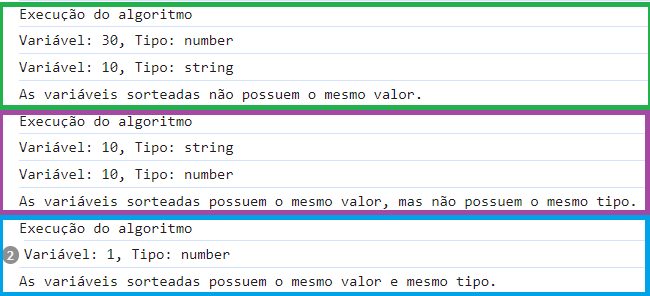

# 7 Days Of Code - Dia 1

## Enunciado do Desafio: 
A sua tarefa de hoje é reescrever o código abaixo de maneira que ele imprima as informações de maneira correta, que faça sentido e sem erros:

```
let numeroUm = 1
let stringUm = '1'
let numeroTrinta = 30
let stringTrinta = '30'
let numeroDez = 10
let stringDez = '10'

if (COMPARAR O numeroUm e a stringUm) {
  console.log('As variáveis numeroUm e stringUm tem o mesmo valor, mas tipos diferentes')
} else {
  console.log('As variáveis numeroUm e stringUm não tem o mesmo valor')
}

if (COMPARAR O numeroTrinta e a stringTrinta) {
  console.log('As variáveis numeroTrinta e stringTrinta tem o mesmo valor e mesmo tipo')
} else {
  console.log('As variáveis numeroTrinta e stringTrinta não tem o mesmo tipo')
}

if (COMPARAR O numeroDez e a stringDez) {
  console.log('As variáveis numeroDez e stringDez tem o mesmo valor, mas tipos diferentes')
} else {
//   console.log('As variáveis numeroDez e stringDez não tem o mesmo valor')
}
```

## Implementação - Funcionalidades:
- Sorteio do valor das 2 variáveis com base nos 6 valores disponíveis citados no desafio;
- Impressão dos valores destas variáveis e seus respectivos tipos;
- Utilização de operadores de igualdade ampla e igualdade estrita para comparar as 2 variáveis entre si;
- Imprime um texto que descreve a comparação entre as 2 variáveis sorteadas;

### Exemplos de Execução:


