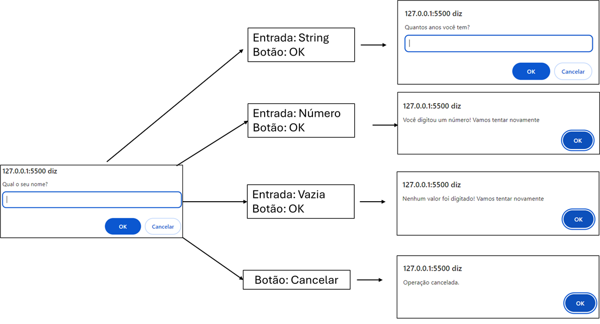
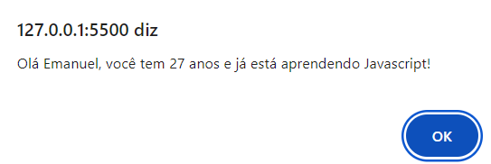
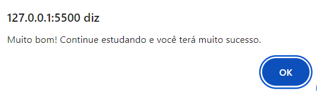

# 7 Days Of Code - Dia 2

## Enunciado do Desafio: 
O programa deve pedir para o usuário responder 3 perguntas:

- Qual o seu nome?
- Quantos anos você tem?
- Qual linguagem de programação você está estudando?

À medida que as perguntas forem sendo feitas, a pessoa que estiver usando o programa deve responder cada uma delas.

No final, o sistema vai exibir a mensagem:
```
"Olá [nome], você tem [idade] anos e já está aprendendo [linguagem]!"
```
Note que cada informação entre [ ] é uma das respostas dadas pela pessoa.

**Exercício Opcional**

Você vai complementar o código para que, depois de exibir a mensagem anterior, o programa pergunte:
```
Você gosta de estudar [linguagem]? Responda com o número 1 para SIM ou 2 para NÃO.
```
E aí, dependendo da resposta, ele deve mostrar uma das seguintes mensagens:

1 > Muito bom! Continue estudando e você terá muito sucesso.
2 > Ahh que pena... Já tentou aprender outras linguagens?


## Implementação - Funcionalidades:
- Solicita os dados de entrada
- Valida os dados fornecidos pelo usuário, considerando os seguintes critérios:
    - Se o tipo do dado de entrada estava de acordo com o esperado (número ou string); 
    - Se o botão OK foi clicado e continha algum valor;
    - Se o botão Cancelar foi clicado;
- Imprime um texto personalizado com base nos dados fornecidos
- Controle de fluxo para imprimir outro texto, com base na resposta do usuário (também há validação)

### Exemplos de Execução:

#### Validação de Dados


#### Textos Personalizados


